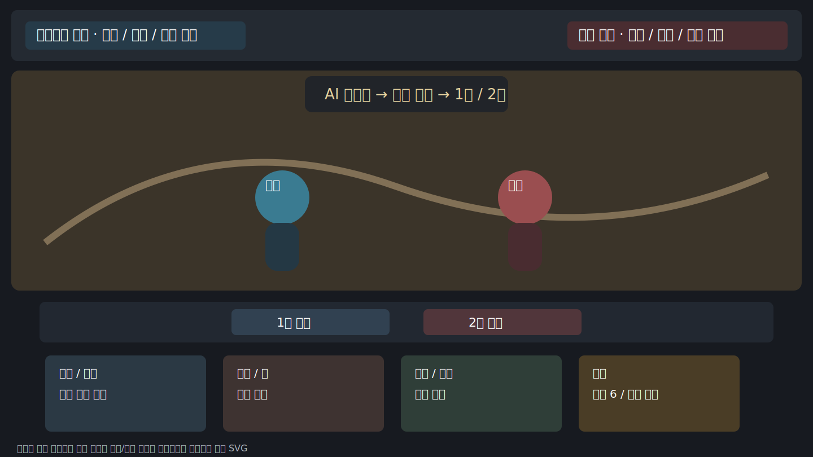
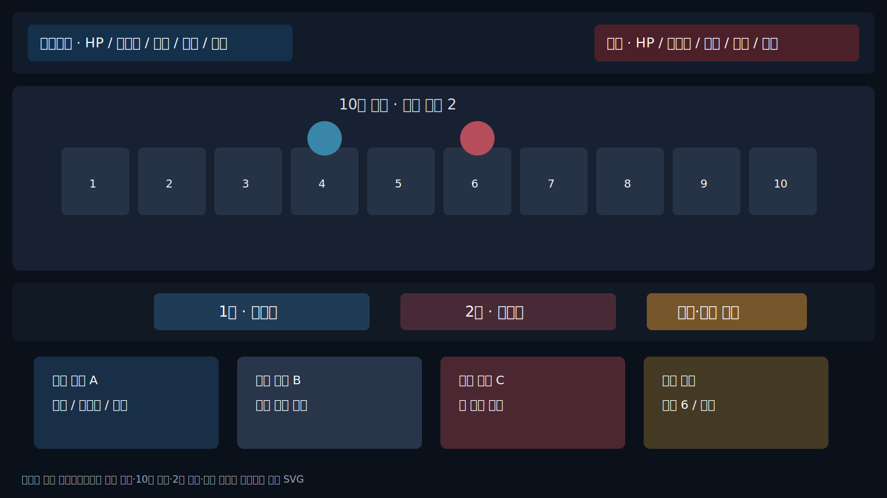

# 전투 UI·UX 기획서

## 목표 화면

- 상단: 상대·플레이어 체력, 자원, 절초 기세.
- 중앙: 10칸 전장과 현재 거리.
- 하단 중앙: 1수·2수 슬롯과 잠금 버튼.
- 하단: 행동 카드와 사용 불가 이유.
- 최하단 또는 우측: 판정 원인 로그.

## 정보 위계

1. 현재 거리와 위치.
2. 체력·행동력·기력·내공.
3. 현재 묶음과 AI 선잠금.
4. 1수·2수.
5. 카드 사용 가능 여부.
6. 결과 원인 로그.

## 절초 HUD 상태

`미해금 → 축적 중 → 절초 가능 → 발동 예약 → 소모`

색상만 사용하지 않고 6칸 도형, `현재/6`, 상태 문구를 함께 표시한다.

## 입력 원칙

- 두 카드가 선택되어야 잠금 가능.
- 선택 초기화는 잠금 전만 가능.
- 잠금 뒤 행동 변경 불가.
- 사용 불가 행동에는 이유 툴팁 제공.
- 전투 종료 후 재시작 가능.
