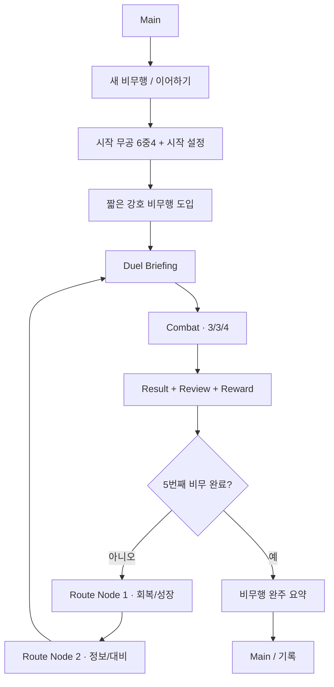

# 십보강호 Vertical Slice · 강호 비무행 기획 정본

> 책임: 첫 Vertical Slice의 세계·플레이어 역할·5전 감정곡선·강호행로 연결·비전투 App Flow  
> 승인 Decision: `TEN-DEC-20260820-JIANGHU-JOURNEY-VERTICAL-SLICE-01`  
> 프로젝트 정체성: `docs/01_GAME_DESIGN.md`  
> 전투 판정: `docs/02_COMBAT_RULES.md`  
> 콘텐츠 슬롯·후보 범위: `docs/03_CONTENT_CATALOG.md`  
> 실행 범위·플레이타임: `docs/05_COMBAT_POC_SPEC.md`  
> 전투 UI: `docs/07_COMBAT_UI_SPEC.md`, `TEN-DEC-20260811-COMBAT-UI-INFORMATION-HIERARCHY-01`

이 문서는 전투 규칙을 재정의하지 않는다. **왜 비무하는지, 5전이 어떤 감정·학습곡선을 만드는지, 비무 사이 선택이 다음 전투와 어떻게 이어지는지**를 책임진다.

## 1. Vertical Slice 한 줄 약속

> 아직 이름이 널리 알려지지 않은 무인이 첫 강호 비무행에서 서로 다른 방식의 무인들을 읽고 5번의 비무를 통과하며, 복기와 준비 선택으로 자기만의 `수읽기`를 만들어 간다.

플레이어가 마지막에 기억해야 하는 것은 `5명을 이겼다`가 아니라 다음이다.

```text
처음에는 눈앞의 기술만 봤다.
→ 버티는 상대에게 조급함을 배웠다.
→ 거리를 읽기 시작했다.
→ 상대도 나를 읽는다는 걸 알았다.
→ 마지막에는 상대의 수와 내 계획을 함께 보게 됐다.
```

## 2. 플레이어 역할

### 2.1 고정하는 것

- 강호에서 아직 널리 알려지지 않은 무인.
- 비무를 통해 이름과 경험을 쌓는 첫 여정 중이다.
- 전투의 의미는 힘의 숫자보다 `상대를 읽고 계획을 고치는 능력`에 있다.
- 시작 무공 6중4와 Route 선택이 이번 회차의 무인상을 만든다.

### 2.2 고정하지 않는 것

- 출신 문파
- 고정 이름·성별·외형
- 가족사·복수 대상
- 구국/천하 통일 같은 거대 사명
- 특정 정파/사파 충성

이 공백은 미작성 설정이 아니라 **플레이어 빌드 자유와 장기 확장을 위한 의도적 보호 공간**이다.

## 3. 강호의 첫인상

첫 Slice의 강호는 백과사전처럼 설명하지 않는다.

플레이어가 직접 접하는 정보 단위는 다음이다.

- 비무 상대의 이명·태도·무공 흔적
- 객잔·길목·수련터·소문처럼 Route에서 만나는 짧은 생활 단서
- `비무에서 무엇을 보였는가`에 대한 주변 반응
- 무공을 대하는 서로 다른 철학
- 다음 상대를 준비할 때 필요한 소문·공개 정보

### 3.1 금지되는 노출 방식

- 시작 직후 장문의 강호 연대표
- 문파 계보를 외우게 하는 인포덤프
- 전투와 무관한 고유명사 연속 소개
- 플레이어가 행동하기 전에 세계의 모든 갈등을 설명

세계관 한 줄이 **다음 행동·선택·기억 중 하나에도 영향을 주지 않으면 후순위**다.

## 4. 반복 인물축

### 4.1 역할 원형

`또래 무인 / 동행과 경쟁의 중간`.

플레이어보다 압도적인 스승도, 정답을 알려주는 해설자도 아니다. 같은 시기에 강호를 걷지만 다른 판단 기준을 가진 인물이다.

이 인물의 기능은 세 가지다.

1. 플레이어의 변화가 보이게 하는 비교 거울.
2. 5개의 분리된 비무를 하나의 여정처럼 묶는 기억점.
3. 장기적으로 다시 만나거나 겨룰 수 있는 관계 씨앗.

### 4.2 등장 비트

| 시점 | 기능 | 분량 기준 |
|---|---|---:|
| 시작 | 같은 길을 걷는 다른 무인의 존재 제시 | 2~4줄 |
| 비무2 뒤 | 플레이어의 첫 선택/결과를 반사 | 1~3줄 |
| 비무4 뒤 | 서로 다른 성장 방향을 암시 | 1~3줄 |
| 비무5 뒤 | 첫 여정 완주의 감정 마침표 | 2~4줄 |

정확한 이름·외형·소속은 시각/캐릭터 제작 전까지 가역 상태로 둔다.

### 4.3 금지

- 숨은 AI 계획을 알려줌
- `다음에는 막기를 써` 같은 정답 코치
- 플레이어 대신 감정을 설명
- 매 Route 노드에 등장하여 여정을 독점
- 첫 Slice에서 강제 연애·원수·사제 관계 확정

## 5. 5전 감정·학습곡선

각 슬롯은 `기계 문법 + 감정 질문 + 읽을 습관 + 반례`를 가진다. 슬롯당 후보 3명은 이 뼈대를 서로 다른 인물성과 무공으로 변주한다.

### Duel 1 · 연교 원형 — `첫 검문`

**기계 질문:** 같은 수에 부딪쳤을 때 `[합]`과 중단이 왜 일어났는가?  
**감정 질문:** `상대가 강한가, 아니면 내가 읽지 못했는가?`  
**목표 감정:** 첫 당혹 → 관찰 → `읽으면 달라진다`는 작은 확신.

설계:

- 앞을 향하는 공격 성향을 비교적 읽기 쉽게 보인다.
- 단, 같은 공격만 반복하지 않는다.
- 첫 복기에서 `내가 피해를 입은 이유`와 `상대 행동이 끊긴 이유`가 선명해야 한다.

성공 신호:

- 플레이어가 다음 계획에서 적어도 한 번 `합/중단`을 의식한다.

### Duel 2 · 묵진 원형 — `금강문답`

**기계 질문:** 방어도·강건·전조에 어떻게 대응하는가?  
**감정 질문:** `세게 치면 언젠가 뚫린다`는 사고가 항상 맞는가?  
**목표 감정:** 답답함 → 조급함 통제 → 기다림/순서의 가치.

설계:

- 버티는 성향은 명확하지만 완전 수동적이지 않다.
- 공격을 퍼붓기만 하는 계획이 자원·순서 면에서 손해를 보게 한다.
- 복기는 `피해 숫자가 낮았다`보다 `왜 방어를 넘지 못했는가`를 설명한다.

### Duel 3 · 설하 원형 — `장풍의 선`

**기계 질문:** 거리·보법·사거리 실패를 어떻게 계획에 넣는가?  
**감정 질문:** `좋은 기술`도 닿지 않으면 무슨 의미가 있는가?  
**목표 감정:** 헛손질 → 공간 인식 → 거리 자체를 자원처럼 보기.

설계:

- 상대가 선호하는 거리대가 읽히되 항상 같은 방향으로 도망치지는 않는다.
- 정보 노드가 있다면 `사거리/보유 무공` 같은 공개 사실을 제공할 수 있다.
- 정답 이동 경로를 직접 제시하지 않는다.

### Duel 4 · 청허 원형 — `유전의 문`

**기계 질문:** 회피 횟수·필중·반격 조건과 상대의 유인을 어떻게 읽는가?  
**감정 질문:** `내가 읽고 있다고 생각한 순간, 상대도 나를 읽는다면?`  
**목표 감정:** 자신감 → 의심 → 적응.

설계:

- 플레이어가 1~3전에서 만든 한 가지 성공 습관을 그대로 반복하면 손해를 볼 여지를 만든다.
- 단, 특정 빌드를 하드 카운터해 진행을 막지 않는다.
- 복기는 `상대가 치팅했다`가 아니라 공개 규칙으로 납득 가능해야 한다.

### Duel 5 · 적우 원형 — `오봉연검`

**기계 질문:** 순차 `[합]`, 피해 중단, 후속타 취소, 잔여 단독타를 한 계획 안에서 이해하는가?  
**감정 질문:** `상대의 수를 읽는 것`과 `내 계획을 완성하는 것`이 하나로 연결됐는가?  
**목표 감정:** 압박 → 집중 → 종합적 수읽기 → 첫 여정의 성취.

설계:

- 1~4전의 단일 교훈을 다시 퀴즈처럼 한 번씩 내지 않는다.
- 여러 규칙이 한 연타 흐름에서 자연스럽게 겹치게 한다.
- 승리 시 `스탯이 높아서 이김`보다 `어떤 순서와 대응이 살아남았는가`를 복기한다.

## 6. 후보 15명 제작 규칙

슬롯당 3인 구조를 유지하면서 제작비를 통제한다.

각 후보는 최소 다음 6필드만으로도 슬롯 기능을 수행할 수 있어야 한다.

```yaml
candidate_id:
duel_slot: 1..5
martial_identity:
readable_habit:
ambiguity_or_counterexample:
public_briefing_hook:
short_personality_hook:
```

후보마다 별도 장편 퀘스트·대사 트리·고유 시스템을 요구하지 않는다.

### 6.1 차별화 축

동일 슬롯 후보는 다음 중 2개 이상이 달라야 한다.

- 선호 거리
- 같은 역할을 수행하는 무공 계통
- 자원 운영 방식
- 공격/대응 타이밍 습관
- 성격·비무 태도
- 공개 정보의 종류

단, 슬롯의 학습 목표를 바꿀 정도로 기계 역할을 갈아엎지 않는다.

## 7. 강호행로 연결

### 7.1 전체 구조

```text
Duel 1
→ Growth/Recovery
→ Information/Preparation
→ Duel 2
→ Growth/Recovery
→ Information/Preparation
→ Duel 3
→ Growth/Recovery
→ Information/Preparation
→ Duel 4
→ Growth/Recovery
→ Information/Preparation
→ Duel 5
```

이 구조는 화면상 반드시 일직선일 필요는 없지만 **실제 방문 노드 수는 구간당 정확히 2개**다.

### 7.2 1차 노드의 플레이어 질문

> `지난 비무에서 생긴 문제 중 무엇을 회복하거나 성장시킬 것인가?`

노드가 만드는 선택:

- 지금 손실을 복구한다.
- 특정 무공을 집중 수련한다.
- 장기 빌드 선택지를 넓힌다.
- 단기 안정성을 포기하고 이후 고점을 노린다.

### 7.3 2차 노드의 플레이어 질문

> `다음 상대에 대해 무엇을 알고 들어갈 것인가?`

정보는 `가설 재료`여야 한다.

좋은 예:

- `설하는 거리를 벌린 뒤 장풍 계통을 자주 사용한다고 알려져 있다.`
- `청허의 무공에는 회피 후 반격 조건이 존재한다.`

나쁜 예:

- `첫 수는 이동, 둘째 수는 강공이다.`
- `막기 → 속공 순서로 쓰면 이긴다.`
- `AI 공격 확률 70%`.

## 8. Briefing 계약

Briefing은 **정보 경계 확인 화면**이다.

### 필수 정보

- 상대 이름/이명
- 한 문장 전투 인상
- 공개 스테이터스
- 현재 조사된 무공/해금 기술 범위
- 강호행로에서 확보한 추가 정보
- 플레이어 현재 체력·자원·무공 구성 요약

### 선택 정보

- 이전 회차에서 이미 만난 후보의 과거 공개 기록
- 해당 슬롯에서 이번에 선택하지 않은 다른 후보와의 차이

### 금지 정보

- AI 현재 잠금 계획
- AI 확률/가중치
- 정답 카드
- 숨은 스크립트 trigger
- `예상 명중률`

## 9. Combat 계약 연결

Combat 자체는 `docs/02_COMBAT_RULES.md`와 전투 UI Decision의 권위다.

비전투 기획이 Combat에 요구하는 것은 두 가지뿐이다.

1. 들어가기 전에 플레이어가 가진 공개 정보가 무엇인지 명확히 전달한다.
2. 끝난 뒤 실제 발생 사건을 복기할 수 있게 증거를 남긴다.

비전투 서사가 Combat 판정에 숨은 보정치를 넣지 않는다.

## 10. Result · Review · Reward 계약

별도 화면을 무한히 늘리지 않고 하나의 Scene/흐름으로 묶는 것을 기본 UX로 한다.

### Layer 1 · 결과

- 승/패
- 핵심 전투 종료 상태
- 현재 승인된 등급 표시가 있다면 그 결과

### Layer 2 · 복기

가장 결정적인 1~3개 사건을 우선한다.

가능한 사건 예:

- 사거리 밖에서 공격하여 체력 피해가 0
- `[합]`에서 현재 피해 단위 패배
- 전조 중 체력 피해로 후속 실행 중단
- 회피 횟수 소진 후 피격
- 자원 부족으로 계획 일부 선택 불가

숨은 정답·미선택 미래 결과를 보여 주지 않는다.

### Layer 3 · 보상

보상은 `다음 Route 선택에 무엇이 달라지는가`가 읽혀야 한다. 사람 검증 전 전투 종료 등급을 경제 증폭기에 연결하지 않는 기존 보호를 유지한다.

## 11. 완주 요약

5전 뒤 완주 화면은 `첫 비무행을 통해 무엇이 달라졌는가`를 사실로 보여 준다.

기본 모듈:

- 실제 만난 5명
- 가장 자주 사용한 공개 행동/무공
- 가장 많이 발생한 복기 사건 유형
- 최종 무공 성장 상태
- 선택한 Route 유형 분포
- 기억할 만한 1~3개 전투 사건
- 반복 인물의 마지막 반응

### 금지

- 내부 AI 가중치 분석 공개
- 플레이어 성격을 단정하는 심리검사
- 하나의 `정답 플레이스타일` 점수
- 사람 검증 전 등급 기반 경제 보너스 확대

## 12. Main부터 완주까지의 화면 흐름



## 13. 비전투 UX 예산

`15~22분` 첫 데모 목표에 맞춘 초기 계측 기준이다.

| 항목 | 목표 |
|---|---:|
| 첫 도입 | 45~60초 이하 |
| Briefing 1회 | 15~30초 |
| Result/Review/Reward 1회 | 20~45초 |
| Route Node 1회 | 20~40초 |
| 첫 회차 비전투 비중 | 약 35~40% 이하 |
| 반복 회차 비전투 비중 | 약 25~30% 이하 |

튜닝 규칙:

- 플레이어가 읽는 시간 때문에 전투 계획 시간이 압축되면 서사량부터 줄인다.
- 반복 회차에서는 이미 읽은 도입·대사·설명을 빠르게 넘길 수 있어야 한다.
- 화면 전환이 많아 체감 흐름이 끊기면 Scene 수보다 기능 통합을 우선한다.

## 14. 첫 Vertical Slice 콘텐츠 예산

### 필수

- 5개 슬롯의 기준 아키타입
- 각 슬롯 후보 최대 3명 구조 지원
- 반복 인물 1명
- 8개 실제 방문 Route 노드
- Briefing
- Result/Review/Reward
- 완주 요약

### 필수가 아님

- 15명 모두 완성 일러스트·장편 서사
- 무림 전체 세력도
- 10전 전체 콘텐츠
- 천하제일인
- 다중 엔딩
- 대화 분기 시스템

## 15. 완료 기준

이 기획 문서의 내용이 구현 준비 상태가 되려면 다음이 닫혀야 한다.

```yaml
planning_acceptance:
  player_role_clear_without_fixed_faction: true
  five_duel_mechanical_roles_preserved: true
  five_duel_emotional_arc_defined: true
  candidate_15_structure_preserved: true
  recurring_character_function_defined: true
  route_two_nodes_per_gap_preserved: true
  briefing_information_boundary_defined: true
  result_review_reward_flow_defined: true
  observation_answer_leak_guardrail_preserved: true
  app_flow_main_to_run_complete_defined: true
  non_combat_time_budget_defined_as_tunable: true
  runtime_change_authorized: false
```

## 16. 검증 계약

이 단계에서는 사람 재미 PASS나 런타임 완료를 주장하지 않는다.

후속 release-near Vertical Slice에서 최소 확인할 것:

- 플레이어가 각 상대를 `규칙 문제`가 아니라 서로 다른 무인으로 기억하는가.
- 5전 동안 감정이 `첫 이해 → 인내 → 공간 인식 → 자기 의심 → 종합`으로 상승하는가.
- Route 정보가 정답을 누출하지 않으면서 다음 계획을 실제로 바꾸는가.
- 비전투 시간이 3/3/4 전투의 집중을 침범하지 않는가.
- 패배 복기가 `왜 졌는지`를 설명하지만 다음 정답을 대신 선택하지 않는가.

실행하지 않은 Godot/Windows/Android/Human 검증은 `NOT_RUN`이다.
