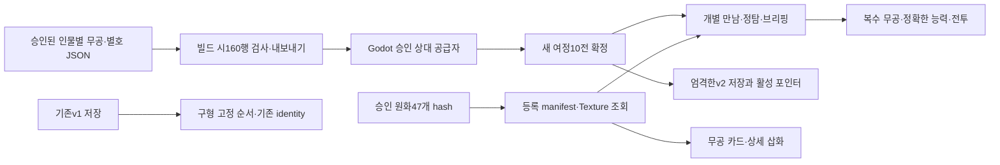

# 가변 상대 편성·승인 원화 구현 기록

기준 c6b795b3 / main885c91ee / Work Mode BUILD·REVIEW / Skill workflow-router, combat-implementation-handoff(build), TDD, subagent-driven-development, ten-paces-verification.

## 사용자 범위와 판단

사용자는112쪽 기획·원화를 확정하고 `맞아 진행해`로 실제 게임 구현을 명시했다.
원래 main 작업 공간과 staging-direction의 미커밋 화면·모션·원화는 보존하고 기존 PR340 분기에서 수행한다.
PR199/200 실제 diff는 읽었지만 각각 역사 frontdoor와 이미 채택된 옛 Base sync이므로 제품 변경을 흡수하지 않는다.
CURRENT_SOURCE_RELEVANCE_CHECK: 동일 승인 결정 차원의11개 공개 비교 및 당일 Godot 저장/RNG 자료를 재사용한다. 별도 프로젝트 자료를 참조하지 않는다.
FEASIBLE: 실제 Godot4.7.1과 run/shell/bridge/codec/카드 UI 경로에 연결 가능. 저장 경로와 소비자가 따로 계산하지 않도록 승인 projection을 공유한다.

## 현재 구현 관계

원본은 OPPONENT_BUDGET/PRESENTATION, 런타임 파생본은 approved_opponent_stages_v2.json이다.
Python은 게임 실행 의존성이 아니다. 가변2~5권은 승인 인물 구성의 결과이며 장착 제한이 아니다.
기존 opponent catalog와 v1 identity 입력은 그대로 유지한다. 새 여정만v2, 이어하기는 저장된10건을 검증해 그대로 읽는다.
같은 사람이 재등장해도 encounter ID가 달라 정탐의 현재 기술 정보가 섞이지 않는다.
공개 UI와 AI에는 전체 미래 roster를 넘기지 않는다. 적 관찰 효과 기술은 새 규칙에서 정의 전체를 제외하며 효과 일부를 임의 재설계하지 않는다.

## 표적 교정과 학습

- TDD: 새 run 진입·선정 원화·160행 runtime provider·schema2 구분·적 관찰 차단에서 RED 후 GREEN.
- 백무진 metadata에 없던 최종 능력 합계를 승인 stage에서 공급해 adapter 실패 교정.
- 정탐이 옛 seed를 읽는 문제와 동일인 재등장 정보 누적을 encounter 단위로 교정.
- v2 저장에서도 기존 논리 write_primary 실패주입을 유지해 실제 화면 publication/재시도 회귀를 보존.
- 기술3성 그림은 현재 캐릭터10성 여부와 무관하게 기술 unlock_star3으로 선택한다.
- 두 차례 전체 검토는 동일 작업에서 이미 수행했으며 초기화하지 않았다. 구현 단계는 파일 소유별 표적 검토·실패 회귀·통합 readback으로 수행한다.

## 검증 현황

기획·그림 관련 Python12건 PASS. Godot 승인 이미지47개 실제 로드·무공30개 실제 컨트롤 바인딩 PASS.
160개 승인 전투 codec·가변2/3/4/5권·오염값 거부, v1 저장·v2 포인터 실패·재시도 PASS.
10,000개 시드에서100,000만남 생성: 인물별6037~6659, 동인 연속755/90000, 동유형8430/90000. 통계는 사람 밸런스의 증거가 아니다.
백무진10회 반복·36행로 synthetic회귀와 v1 10전 회귀 PASS.
Windows 실제 OpenGL 실행1280×800 브리핑·전투 캡처 확인. 캡처는 tmp/variable-briefing.png와 variable-combat.png, 최종 증거 경로는 closeout에서 등록한다.
실제 입력 native10전 PASS:295개 입력,10승·보상10·행로36·201094ms, 실패0. 테스트는 실제 판정·표시된 버튼을 사용하며 합성승리로 대체하지 않았다.
최종 native 증거: docs/blueprint/evidence/variable-runtime-20260911/variable-native-campaign.log 및 브리핑/전투PNG.
기존 durable continue·combat checkpoint·run store/cache·bimu UI·martial actor·failure/retry·rest presentation 회귀는 각각 독립 수행한다. 원격 전체 CI는 exact commit 후 확인한다.
전체 Python discover는 출력 없는 대기 상태에서 중단해 PASS로 세지 않았으며 관련12건은 별도 실행 결과다.
Human/Android/접근성 사용자/출시: NOT_RUN.

## 최종 통합 검증과 보존

저장 이전 버전 정리는 성공한 active포인터 재읽기 이후에만 수행한다. 같은 save_id의 초기·직전·현재3본을 유지하고,
정상 decode·schema2·파일명digest·실제bytes SHA가 모두 일치하는 이번 저장 방식의 생성본만 정리한다.
미확인·손상·다른 save_id·구형 파일은 보존하며 정리 실패는 정상 저장을 실패로 바꾸지 않는다. 8회 이상 쓰기·거부·후속회복 회귀 PASS.
별도 통합 검토에서 새 blocker 없음. 기존 긴 저장 회귀와160행 codec를 독립 재실행했다.
로컬 보호 wrapper는 Godot import가 만든 범위 밖 sidecar/EOL까지 읽어 불일치했으므로 이를 삭제하거나 승인 목록에 추가하지 않았다.
동일 commit의 새 import 전 검증 작업 공간에서 wrapper를 재검증한다. 원래 사용자·staging 작업은 그대로 보존한다.

## 원격 검사에서 드러난 역사 fixture 교정

첫 e169bc2a CI는 이전 active자산17개만 허용하던 단언과 옛 martial_identity 표시 단언 때문에 실패했다.
기존24개 자산 레코드 해시를 보존하고 정확한 신규47개 승인집합을 함께 검사하도록 갱신했다.
표시 별호는 현재 encounter.epithet, v1은 기존 martial_identity를 대조한다. 비무 제약 fixture는
플레이어 숙련도 변경 시 적의 현재 resolved_encounter를 유지하고 정탐은 v2 만남ID를 사용한다.
기존 검사를 삭제하지 않았으며 각각 실제 실패 후 동일검사 GREEN을 확인했다.
