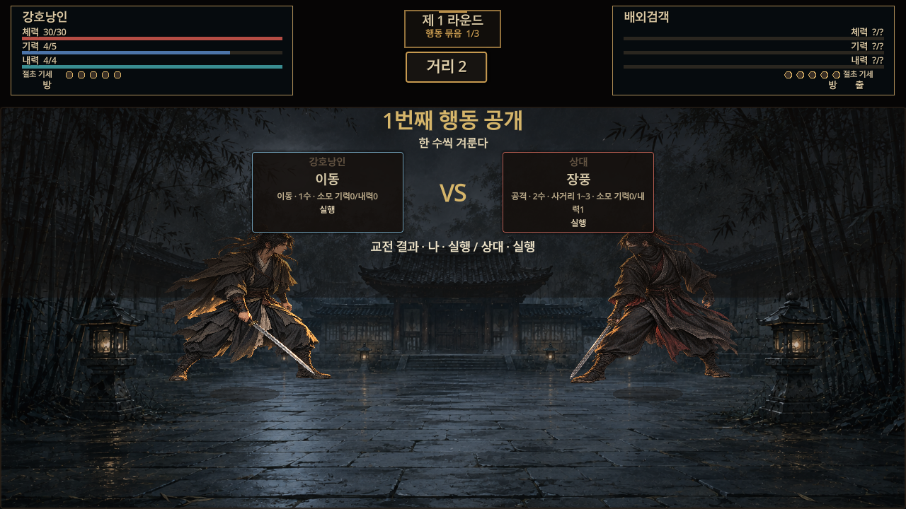
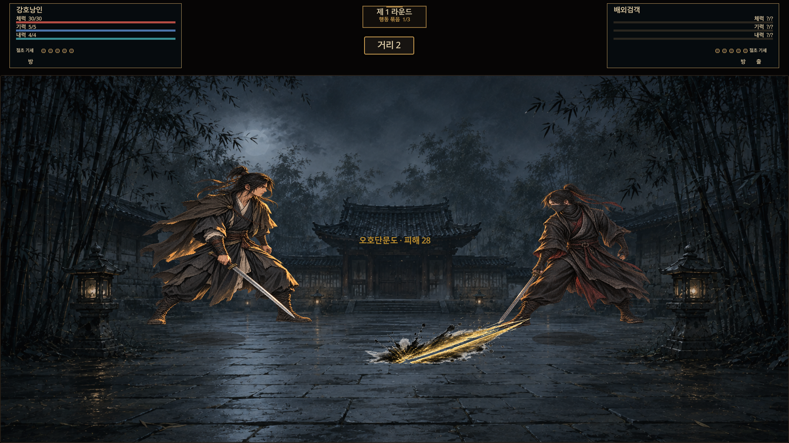

# 전투 화면 교정 — 실제 인게임 캡처

이 자료는 실제 Godot Board 화면에서 확인한 **제한된 배치·연출 검증**이다. 승인 아틀라스의 완전한 재현, 전체 여정 플레이, 최종 사람 가독성·선호 또는 출시 승인이 아니다.

## 확인한 화면

| 화면 | 실제 해상도 | 캡처 |
|---|---|---|
| 준비 → 이번 수 비교 → 이동 → 합 결과 → 다음 준비 | 1280×720 | 007–011 |
| 같은 실제 행동 선택/실행 흐름 | 1280×800 | 012–016 |
| 같은 실제 행동 선택/실행 흐름 | 1920×1080 | 017–021 |
| 팽가 절초 확대와 복귀 | 1280×800 | 023–024 |
| 기존 절초 확대와 복귀 | 1280×800 | 025–026 |
| 음소거·움직임 감소 설정의 효과 표시/복귀 | 1280×800 | 027–028 |
| 도겸 적 이미지와 플레이어 상태 | 1280×800 | 029 |
| 긴 무공명/결과 문구의 표시 전용 예시 | 1280×800 | 030 |
| 이번 수 비교에서 건너뛰기 → 다음 준비 | 1280×800 | 031–032 |
| 절초 확대 → 실제 창 크기 변경 → 복귀 | 1280×800 → 1920×1080 | 033–035 |

번호는 모두 `TEN-RVC-20260909-` 접두어를 사용한다. 035의 내부 시나리오 이름은 800에서 시작한 것을 나타내지만 **실제 PNG와 Window는1920×1080**이다. 파일별 책임 기록은 [캡처 정본](../../evidence/RUNTIME_VISUAL_CAPTURE_MANIFEST.json), 구현·시험은 [실행 기록](../../operations/2026-09-09_COMBAT_LAYOUT_EXECUTION_REPORT.md)이다.

## source와 재현 경계

- 제품 source: `eda26a97f25a931ac02ba739d5c4921720512d41`. 세 제품 파일·일곱 회귀/CI 경로에 한정한다. 전체499검사315.57초는 이 source에서 controller가 실행했다.
- Godot4.7.1 stable official `a13`, Windows native. 실제 Board scene을 별도 캡처 fixture가 인스턴스화한다. 007–021 및031–032는 실제 action dock/CTA 흐름이다.
- 팽가/기존 절초는 실제 resolver가 만든 이벤트를 seed한 Board 연출이며, 정상 RunSession의 저장·자원 HUD 전체 일관성 증거가 아니다. 긴 문구030은 표시 전용 fixture이며 실제 기술/전투 성공이라고 하지 않는다.
- 도겸029는 제품의 실제 enemy 소비처와 고정 player 그림을 함께 검증한다. 도겸 플레이어 그림을 새로 만들거나 강제로 주입하지 않는다.
- 최종 재현 helper는 [capture_fixture.gd.txt](capture_fixture.gd.txt), [scene](capture_fixture.tscn.txt), [collector](capture_controller.py.txt)로 보존한다. 실행하지 않는 텍스트 companion이며 자동 제품 consumer가 아니다. 실제 helper의 원본 byte SHA는 `E3CE523AFF91D7AB689E880C9E7BF888322292A98F6F5333DD9259B0C9771C77`다. 텍스트 companion은 줄바꿈 정규화로 byte SHA가 다를 수 있다. **최종 helper는033–035에 해당하며 이전 모든 캡처가 같은 helper revision을 사용했다고 주장하지 않는다.**
- 실제 Window 크기를 먼저 맞추고 readback이 일치할 때만 begin한다. 논리 canvas 확대·이미지 재편집·synthetic 그림·manual tween tick 없이 실제 게임 화면을 저장했다. 각 PNG는 producer 전 source-absent receipt 및 일회 nonce로 등록했다.
- 원본 source/receipt/producer/raw snapshot은 [보존 readback](capture_readbacks.json)에 연결한다. 003에는 초기 receipt/PNG는 있으나 같은 이름의 raw call-chain JSON은 없어 그 체인을 검증했다고 쓰지 않는다.
- 최종 native editor는28152, 007–032 game35992, 033–035 game34240이었다. 이 번호는 해당 실행의 역사이며 다음 실행 권한이 아니다. 재현 시 exact editor/game/시작시각/전체 명령을 새로 확인해야 한다. 이전 다른 프로젝트/editor에는 접근하지 않는다.

## 실제 실패와 수정 이력

004는 비교 overlay fade의 alpha0에,006은 결과 문구 fade의 alpha0에 캡처되어 **가시성 PASS가 아니다**. 005는 실제 이동이다. 이후 실제 alpha와 두 callout의 렌더 영역을 기다리는 제한된 gate로007–021을 재실행했다. 초기 embedded game은720을 요청해도800으로 유지되어720증거로 사용하지 않았다. 프로젝트별 `game_view/embed_on_play=false`를 적용한 owned editor 재시작 후 실제 native 크기를 확인했다. 전역 편집기 설정은 바꾸지 않았다.

022의 절초 peak 신호는 유효하지만 뒤따른 resize 검사는 실패했다. Tween callback의 scale1.08/alpha.9599999785와 해당 프레임이 끝난 뒤 실제 일시정지 상태는 원자적으로 같지 않았다. 이를 제품 배치 결함이나 성공으로 바꾸지 않았다. 최종 helper는 실제 Window 변경 직전 상태를 별도로 채취하고 변경 직후 **같은 Tween, running 상태, alpha/scale의 정확한 동등성, SFX marker**를 검사한다. 033의 peak 신호와034의 실제 resize baseline(scale약1.078875/alpha.94650131464005)은 서로 다른 증거다. 035에서 원래 연출의 복귀를 확인했다.

초기 전체 연출 대기5초가 실제3수 해결의 합산 시간에 충분하지 않아 실패했다. 단일 phase는600frames/5초로 유지하고 전체 후속 준비 대기만1800frames/15초로 제한했다. 초기 helper 타입/경로 오류·일시 IPC 탐색 실패는 setup 실패로 기록하며 제품 RED나 성공으로 세지 않는다.

## 진단과 아직 남은 품질

[편집기 진단](editor_diagnostics.json)의 당시 완전한 반환 버퍼는 오류0행/경고18행이다. 기존 제품17경고와 helper1경고이며 **무경고가 아니다**. 원본 응답에는 개별 game run_id가 없어 모든 캡처의 전체 게임 로그를 독립 증명하지 않는다. collector의 정적 숫자 자체를 실시간 진단 조회로 오해하지 않는다. [독립 검토](independent_review.md)가 PNG/hash/receipt/call-chain과 진단 원문을 대조했다.

실제 화면에 남은 후속 과제는 다음과 같다.

- 계획 화면의 작은 글자·관찰 설명/장식 겹침과1080의 큰 여백
- 긴 한글 무공명/소모량의 부자연스러운 줄바꿈
- 합 순간 두 인물의 강한 중첩과 글자 뒤의 복잡한 실루엣
- 기존 portrait의 square draw 비율과 불투명 발/그림자의 지각적 접지감

이번 배치의 기술적 경계 통과와 이 품질 문제는 별개다. 이를 숨기려고 글자 축소·삭제, 승인 이미지 crop/교체, 모션 수치 변경, alpha 기준 완화는 하지 않았다. 실제 청음/물리 입력/접근성 사용자/Android 실기기/권리·출시/Human 승인은 `NOT_RUN`이다. 정책 freshness 역시 producer 진위 또는 시각 품질 전체의 보증이 아니다.
